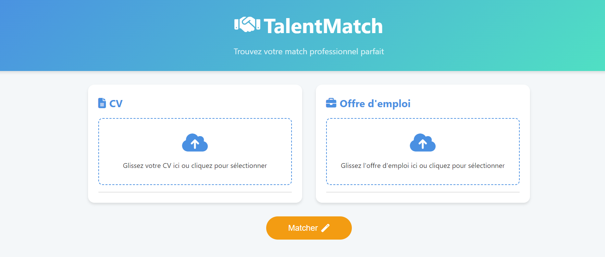

# Talent-Match

## À propos

Talent-Match est une application CVthèque pour le processus de recrutement. En utilisant des techniques d'analyse et de comparaison, cette application permet une gestion efficace des candidatures et des offres d'emploi, facilitant ainsi la correspondance entre les talents et les opportunités.

**Application déployée :** [https://talent-match-946681472540.europe-west9.run.app/](https://talent-match-946681472540.europe-west9.run.app/)



## Fonctionnalités principales

- **Upload et gestion de CV**: Téléchargez et gérez facilement les CV des candidats au format PDF.
- **Création d'offres d'emploi**: Ajoutez et gérez vos offres d'emploi directement sur la plateforme.
- **Analyse intelligente**: Utilisation de l'IA (GPT-4) pour extraire les compétences et informations clés des CV et des offres d'emploi.
- **Matching avancé**: Comparaison automatique entre les CV et les offres d'emploi avec un score de correspondance.
- **Recherche optimisée**: Recherchez rapidement dans les CV et les offres d'emploi.
- **Interface utilisateur intuitive**: Une expérience utilisateur fluide et réactive.

## Technologies utilisées

- **Backend**: Python, FastAPI
- **Frontend**: HTML, CSS, JavaScript (avec templates Jinja2)
- **IA et ML**: OpenAI GPT-4, SentenceTransformers
- **Base de données**: Système de fichiers (JSON pour les métadonnées)
- **Déploiement**: Docker, AWS

## Installation et configuration

1. Clonez le repository:
   ```
   git clone https://github.com/ibrahimaD73/Talent-Match.git
   cd Talent-Match
   ```

2. Créez un environnement virtuel et activez-le:
   ```
   python -m venv venv
   source venv/bin/activate  # Sur Windows: venv\Scripts\activate
   ```

3. Installez les dépendances:
   ```
   pip install -r requirements.txt
   ```

4. Configurez les variables d'environnement:
   Créez un fichier `.env` à la racine du projet et ajoutez:
   ```
   OPENAI_API_KEY=votre_clé_api_openai
   ```

5. Lancez l'application:
   ```
   uvicorn main:app --reload
   ```

L'application sera accessible à `http://localhost:8000`.

## Utilisation

1. Accédez à l'interface web via votre navigateur.
2. Utilisez les formulaires pour uploader des CV ou créer des offres d'emploi.
3. Utilisez la fonctionnalité de matching pour comparer un CV à une offre d'emploi.

## Déploiement

Le projet est configuré pour être déployé avec Docker. Utilisez les commandes suivantes pour construire et exécuter le conteneur:

```
docker build -t talent-match .
docker run -p 8000:8000 talent-match
```

## Contribution

Les contributions sont les bienvenues ! N'hésitez pas à ouvrir une issue ou à soumettre une pull request.